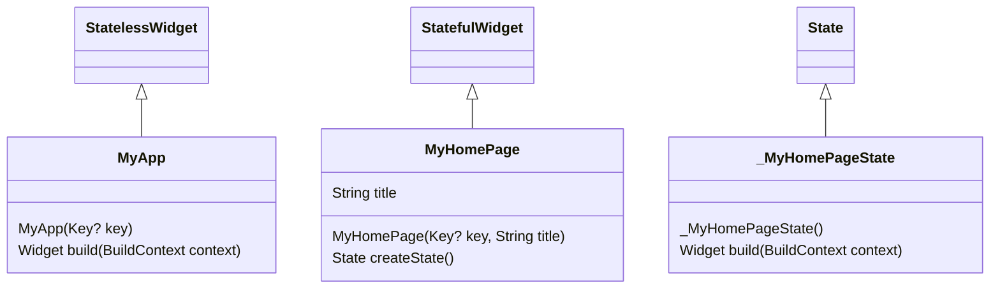

```mermaid
classDiagram
class MyApp {
  MyApp(Key? key)
  Widget build(BuildContext context)
}
StatelessWidget <|-- MyApp
class MyHomePage {
  String title
  MyHomePage(Key? key, String title)
  State<MyHomePage> createState()
}
StatefulWidget <|-- MyHomePage
class _MyHomePageState {
  _MyHomePageState()
  Widget build(BuildContext context)
}
State <|-- _MyHomePageState
```
