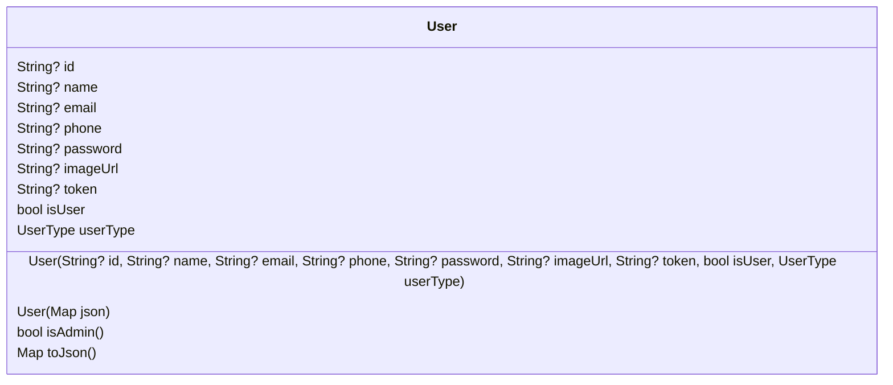

```mermaid
classDiagram
class User {
  String? id
  String? name
  String? email
  String? phone
  String? password
  String? imageUrl
  String? token
  bool isUser
  UserType userType
  User(String? id, String? name, String? email, String? phone, String? password, String? imageUrl, String? token, bool isUser, UserType userType)
  User(Map<String, dynamic> json)
  bool isAdmin()
  Map<String, dynamic> toJson()
}
```
